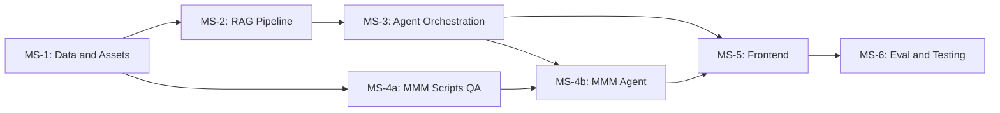

# RAG + MMM Platform -- Team Execution Plan

## Current State Assessment

The foundation is solid. Key components already working:

- **Data layer**: 19 CSVs, 7 contracts, 3 MMM-ready weeklies, asset generator (326 lines), validation framework
- **API**: 8 endpoints (raw dashboard, RAG chat via file reading, data profiles)
- **Frontend**: 3 pages scaffolded (RagChat functional with agent, MmmDashboard hardcoded, DataManagement live)
- **RAG ingestion**: `[src/rag/data_processing/ingest.py](src/rag/data_processing/ingest.py)` -- full LlamaIndex document loading (280 lines)
- **MMM scripts**: All 4 analysis scripts implemented in `[src/platform/api/mmm_scripts/](src/platform/api/mmm_scripts/)`
- **MMM summary**: `[src/platform/api/mmm_summary.py](src/platform/api/mmm_summary.py)` -- builds KPIs from `model_ready.csv`
- **Agent**: `[src/platform/api/rag_agent.py](src/platform/api/rag_agent.py)` -- reads files directly, no embeddings

**Key gaps to fill**: Qdrant vector store, embedding pipeline, hybrid retrieval, multi-agent orchestration via Agent SDK, MMM API endpoints, frontend live-data integration, evaluation framework.

---

## Milestone Dependency Graph

**Parallel tracks after MS-1**: MS-2 (RAG pipeline) and MS-4a (MMM scripts QA) can run simultaneously on different team members.

---

## MS-1: Synthetic Data and Mock Assets (Foundation)

**Goal**: Ensure all generated data is complete and the asset pipeline produces actual PNG files.

**What exists**: `assets.py` (326 lines), `generate_all.py` (8 steps), all generators. However: PNG files are not on disk, and `aggregate_mmm` import is broken (logic lives in `validators.py`).

**Tasks**:

- **1.1** Fix the `aggregate_mmm` import issue in `generate_all.py` -- either create `data/generators/aggregate_mmm.py` that re-exports from `validators.aggregate_mmm_data()`, or fix the import path directly
- **1.2** Add `Pillow>=10.0.0` to `requirements.txt` if not present; add `qdrant-client>=1.9.0` and `llama-index-vector-stores-qdrant>=0.3.0` for MS-2
- **1.3** Run `python data/generators/generate_all.py` end-to-end and verify: all 19 CSVs, 7 contracts, ~50 PNGs in `data/assets/{channel}/`, `asset_manifest.csv` with 50+ rows, all 10 validation checks pass
- **1.4** Add `data/assets/*.png` and `data/qdrant_db/` to `.gitignore`

**Verify**: `ls data/assets/meta/ data/assets/google/ data/assets/tv/` shows PNGs; `wc -l data/assets/asset_manifest.csv` >= 51

---

## MS-2: RAG Pipeline -- Embed, Index, Retrieve

**Goal**: Ingest all documents into Qdrant, build BM25 index, expose hybrid search.

**What exists**: `[src/rag/data_processing/ingest.py](src/rag/data_processing/ingest.py)` (document loading). Stubs in `embeddings/` and `retrieval/`.

**Tasks**:

- **2.1** Create `src/rag/embeddings/indexer.py` (~160 lines) -- Two Qdrant collections (`text_documents`, `campaign_assets`) using embedded mode at `data/qdrant_db/`, plus BM25 index persisted to `data/index/bm25/`. Use `OpenAIEmbedding(model="text-embedding-3-small")` and `SentenceSplitter(chunk_size=1024, chunk_overlap=50)`.
- **2.2** Create `src/rag/retrieval/query_engine.py` (~120 lines) -- `build_text_query_engine()` with `QueryFusionRetriever` (vector + BM25, reciprocal rerank), `build_asset_query_engine()` for image description search, `search_text(query, top_k, category)` and `search_assets(query, top_k, channel)` for raw node retrieval.
- **2.3** Create `src/rag/data_processing/build_index.py` (~50 lines) -- CLI entry point supporting `--text`, `--assets`, `--check` flags. Calls `ingest.py` loaders then `indexer.py` build functions.
- **2.4** Update `.env.example` with optional `QDRANT_PATH` override

**Verify**: `python -m src.rag.data_processing.build_index && python -c "from src.rag.retrieval.query_engine import search_text; print(search_text('Meta CPM'))"`

---

## MS-3: Agent Orchestration -- Multi-Agent Routing

**Goal**: Replace the flat file-reading agent with MCP-tool-backed multi-agent orchestration using Claude Agent SDK.

**What exists**: `[src/platform/api/rag_agent.py](src/platform/api/rag_agent.py)` (basic single agent). No `agents/` directory.

**Tasks**:

- **3.1** Create `src/platform/api/agents/__init__.py`
- **3.2** Create `src/platform/api/agents/tools.py` (~120 lines) -- Three MCP tools wrapping LlamaIndex: `search_data`, `search_assets`, `filter_by_channel`. Each tool calls the corresponding function in `query_engine.py`.
- **3.3** Create `src/platform/api/agents/prompts.py` (~250 lines) -- `ORCHESTRATOR_PROMPT` (intent classification + delegation rules), `RAG_AGENT_PROMPT` (knows all 19 CSVs, 7 contracts, ~50 assets, uses MCP tools, cites sources), `MMM_AGENT_PROMPT` (knows `model_ready.csv`, runs scripts via Bash).
- **3.4** Create `src/platform/api/agents/rag_router.py` (~160 lines) -- `ask_with_routing(question, session_id)` using `ClaudeSDKClient`. Defines `rag-analyst` subagent with MCP tools. Routes "find/show/compare" queries to RAG agent. Returns `{reply, sources, session_id, agent_used}`.
- **3.5** Update `[src/platform/api/main.py](src/platform/api/main.py)`:
  - Modify `POST /api/rag/chat` to accept `session_id`, call `rag_router.ask_with_routing`, return `{reply, sources, session_id, agent_used}`
  - Add `GET /api/assets/search?q=...&channel=...` -- calls `search_assets()`
  - Add `GET /api/assets/image/{path}` -- serves images from `data/assets/` with path traversal protection
- **3.6** Keep `rag_agent.py` as fallback reference (do not delete)

**Verify**: `curl -X POST localhost:8000/api/rag/chat -d '{"message":"What is Meta CPM?"}' | jq .sources`

---

## MS-4a: MMM Scripts QA (Parallel with MS-2/MS-3)

**Goal**: Validate and harden the existing MMM scripts and summary module.

**What exists**: All 4 scripts in `[src/platform/api/mmm_scripts/](src/platform/api/mmm_scripts/)` and `[mmm_summary.py](src/platform/api/mmm_summary.py)`.

**Tasks**:

- **4a.1** Run each script standalone and validate JSON output: `regression.py` (r_squared > 0.5, coefficients dict), `roi_analysis.py` (11 channels with ROI), `budget_optimizer.py` (constraints hold: each channel +/-30%, total unchanged), `adstock_curves.py` (per-channel arrays)
- **4a.2** Verify `mmm_summary.py` returns all required fields: `total_spend`, `total_units`, `total_revenue`, `channel_breakdown`, `weekly_spend`, `weeks_of_data`
- **4a.3** Add `src/platform/api/mmm_scripts/__init__.py` if missing
- **4a.4** Fix any issues found (edge cases, missing error handling, output format inconsistencies)

**Verify**: `python src/platform/api/mmm_scripts/regression.py | python -m json.tool`

---

## MS-4b: MMM Agent + API Endpoints

**Goal**: Wrap MMM scripts with an Agent SDK agent, expose API endpoints, and extend the orchestrator to route MMM intents.

**Depends on**: MS-3 (base orchestrator) + MS-4a (validated scripts).

**Tasks**:

- **4b.1** Create `src/platform/api/agents/mmm_agent.py` (~120 lines) -- `ask_mmm_question(question)` using `ClaudeAgentOptions` with `MMM_AGENT_PROMPT`, tools: `Read`, `Bash`, `Glob`, `Grep`. Agent reads `data/mmm/`, runs `mmm_scripts/*.py`, interprets JSON output.
- **4b.2** Update `src/platform/api/agents/rag_router.py` -- Register `mmm-analyst` subagent. Add routing rules: "optimize/model/ROI/budget" queries go to MMM agent.
- **4b.3** Update `[src/platform/api/main.py](src/platform/api/main.py)`:
  - Add `GET /api/mmm/summary` -- calls `mmm_summary.build_mmm_summary()`
  - Add `POST /api/mmm/chat` -- calls `mmm_agent.ask_mmm_question(question)`

**Verify**: `curl localhost:8000/api/mmm/summary | jq .total_spend` and `curl -X POST localhost:8000/api/mmm/chat -d '{"question":"What is TV ROI?"}'`

---

## MS-5: Frontend Integration

**Goal**: Wire the React UI to live backend data. Replace hardcoded content with real API responses.

**Depends on**: MS-3 + MS-4b (all API endpoints live).

**Tasks**:

- **5.1** Update `[ui/platform/src/api.js](ui/platform/src/api.js)`:
  - Modify `sendChatMessage` to pass/receive `session_id`
  - Add `sendMmmQuestion(question)` -- POST `/api/mmm/chat`
  - Add `searchAssets(query, channel)` -- GET `/api/assets/search`
- **5.2** Update `[ui/platform/src/pages/RagChat.jsx](ui/platform/src/pages/RagChat.jsx)`:
  - Store `sessionId` in component state (persist in `sessionStorage`)
  - Show source file citations below assistant bubbles
  - Show agent badge (rag-analyst / mmm-analyst) next to responses
  - Render inline image thumbnails when response includes `image_path` fields
  - Pass `session_id` in subsequent messages for continuity
- **5.3** Rewrite `[ui/platform/src/pages/MmmDashboard.jsx](ui/platform/src/pages/MmmDashboard.jsx)` (~250 lines):
  - Fetch `/api/mmm/summary` on mount -- populate KPI cards with real data
  - Replace placeholder charts with CSS bar charts from `channel_breakdown`
  - Add "Ask MMM" chat section at bottom (reuse bubble pattern from RagChat)
  - Update header badge from "Model not yet trained" to show actual stats
  - Add error state when backend is unavailable
- **5.4** Add graceful error states on all pages when backend is not running

**Verify**: Browser testing -- RAG Chat shows sources and images, MMM Dashboard shows real numbers, session continuity works.

---

## MS-6: Evaluation and Testing

**Goal**: Achieve 95% retrieval hit rate and comprehensive test coverage.

**Depends on**: MS-5 (all pipelines functional).

**Tasks**:

- **6.1** Create `tests/evaluation/eval_questions.yml` (~50 curated Q&A pairs) -- balanced across categories: ~15 digital media, ~10 sales pipeline, ~10 contracts, ~10 traditional media, ~5 cross-category. Include asset search queries.
- **6.2** Create `tests/evaluation/run_retrieval_eval.py` (~120 lines) -- For each question: run hybrid retrieval (top_k=5), check expected sources in results, compute hit_rate and MRR. Report per-category breakdown and failing queries.
- **6.3** If below 95% hit rate, apply tuning levers in order: increase top_k to 10, increase chunk_overlap to 100, enable query expansion (num_queries=3), add metadata pre-filtering, add document summary layer.
- **6.4** Create `tests/integration/test_rag_pipeline.py` (~100 lines) -- document loading, embedding, retrieval tests
- **6.5** Create `tests/integration/test_mmm_scripts.py` (~80 lines) -- each script produces valid JSON, regression R-squared > 0.5, optimizer constraints hold
- **6.6** Create `tests/integration/test_agent_endpoints.py` (~60 lines) -- RAG chat returns reply + sources, MMM summary returns expected fields, MMM chat returns reply
- **6.7** Run full test suite: `pytest tests/ -v --cov=src --cov-report=term-missing` -- target >= 80% coverage

**Verify**: `python tests/evaluation/run_retrieval_eval.py` shows >= 95% hit rate, >= 0.80 MRR

---

## MS-7: Cloud Migration (Future -- Placeholder)

Not in current sprint scope. Provisional tasks for later:

- Containerize with Docker + docker-compose
- Migrate Qdrant to managed cloud instance
- Move assets to S3/GCS object storage
- Set up CI/CD (GitHub Actions: lint, test, build, deploy)
- Externalize all secrets via env vars / secret manager

---

## Team Assignment Recommendations

**Parallel Track A** (RAG-focused):

- MS-1 (data fix) then MS-2 (RAG pipeline) then MS-3 (agent orchestration)

**Parallel Track B** (MMM-focused):

- MS-1 (shared) then MS-4a (MMM scripts QA) then MS-4b (MMM agent)

**Track C** (Frontend):

- Can start drafting eval questions early (MS-6.1)
- MS-5 begins once MS-3 + MS-4b APIs are live

---

## Risk Mitigation

- **OPENAI_API_KEY not set**: `build_index` should print a clear error; agent falls back to file reading via `rag_agent.py`
- **Only ~17 post-launch data points for MMM**: Ridge regression with regularization handles this; reduce features if needed
- **Agent response time 15-30s**: Use `model="sonnet"` for subagents; add loading indicator in UI
- **Below 95% retrieval accuracy**: 5 tuning levers available (top_k, overlap, query expansion, metadata filter, two-stage retrieval)
- **Path traversal on asset serving**: Normalize paths under `data/assets/`, reject `..` and absolute paths with 400

---

## File Impact Summary

**New files (17)**:

- `src/rag/embeddings/indexer.py`, `src/rag/retrieval/query_engine.py`, `src/rag/data_processing/build_index.py`
- `src/platform/api/agents/__init__.py`, `agents/tools.py`, `agents/prompts.py`, `agents/rag_router.py`, `agents/mmm_agent.py`
- `tests/evaluation/eval_questions.yml`, `tests/evaluation/run_retrieval_eval.py`
- `tests/integration/test_rag_pipeline.py`, `tests/integration/test_mmm_scripts.py`, `tests/integration/test_agent_endpoints.py`
- Possibly `data/generators/aggregate_mmm.py` (or fix import path)
- `src/platform/api/mmm_scripts/__init__.py`

**Modified files (7)**:

- `requirements.txt` -- add Qdrant deps
- `data/generators/generate_all.py` -- fix aggregate_mmm import
- `src/platform/api/main.py` -- add 5 endpoints
- `ui/platform/src/api.js` -- add session_id, MMM, assets functions
- `ui/platform/src/pages/RagChat.jsx` -- sessions, sources, images
- `ui/platform/src/pages/MmmDashboard.jsx` -- rewrite with live data
- `.env.example` -- add QDRANT_PATH

