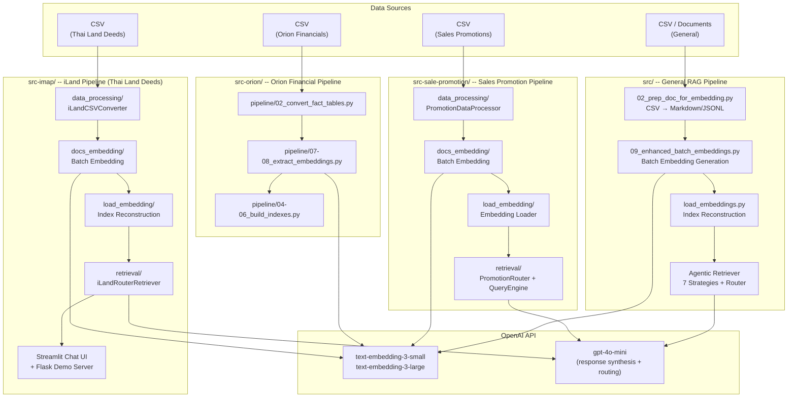
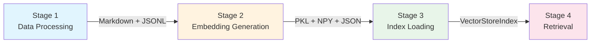
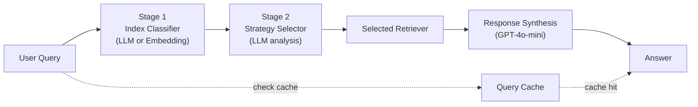

# Project Overview & Architecture Map

> **LlamaIndex RAG Pipeline** -- A multi-domain Retrieval-Augmented Generation platform that transforms CSV/document data into searchable vector embeddings with intelligent, strategy-aware retrieval.

---

## 1. System Architecture

The project contains **four independent pipelines**, each targeting a different business domain. All pipelines share the same 4-stage flow (Data Processing, Embeddings, Index Loading, Retrieval) and the same core tech stack.



---

## 2. Tech Stack

| Layer | Technology | Purpose |
|-------|-----------|---------|
| **Framework** | LlamaIndex (>=0.9) | Document indexing, retrieval strategies, query engines |
| **LLM** | OpenAI GPT-4o-mini | Response synthesis, strategy routing, query planning |
| **Embeddings** | OpenAI text-embedding-3-small / 3-large | Vector representations (1536 or 3072 dims) |
| **Data** | pandas (>=2.0) | CSV loading, data transformation |
| **Web UI** | Streamlit (>=1.34) | WhatsApp-style chat interface (iLand) |
| **API Server** | Flask | Demo REST API (iLand) |
| **Search** | llama-index-retrievers-bm25 | Keyword search component for hybrid retrieval |
| **Config** | python-dotenv, PyYAML | Environment variables and dataset configs |
| **Testing** | pytest | Unit, integration, and e2e tests |

---

## 3. The 4-Stage Pipeline Flow

Every pipeline follows the same conceptual stages. The table below maps each stage to the concrete entry points in each pipeline.



### Stage 1 -- Data Processing

Raw CSV files are parsed, normalized, and converted into structured documents (JSONL) and human-readable Markdown files.

| Pipeline | Entry Point | Key Details |
|----------|------------|-------------|
| **src/** | `src/02_prep_doc_for_embedding.py` | `FlexibleCSVConverter` -- auto-generates field configs from CSV headers |
| **iLand** | `src-imap/data_processing/main.py` | `iLandCSVConverter` -- Thai text normalization, province extraction, batch processing (500/batch) |
| **Sale Promo** | `src-sale-promotion/data_processing/main.py` | `PromotionDataProcessor` -- YAML-driven field mappings, 29 metadata fields, Buddhist-to-Gregorian date conversion |
| **Orion** | `src-orion/pipeline/02_convert_fact_tables.py` | Reuses `FlexibleCSVConverter` from `src/`, processes 5 financial datasets via YAML configs |

### Stage 2 -- Embedding Generation

Documents are chunked and embedded using OpenAI's embedding API with batch processing and rate-limit management.

| Pipeline | Entry Point | Model | Dimensions |
|----------|------------|-------|------------|
| **src/** | `src/09_enhanced_batch_embeddings.py` | text-embedding-3-small | 1536 |
| **iLand** | `src-imap/docs_embedding/batch_embedding.py` | text-embedding-3-small | 1536 |
| **Sale Promo** | `src-sale-promotion/docs_embedding/batch_embedding.py` | text-embedding-3-large | 3072 |
| **Orion** | `src-orion/pipeline/07_extract_embeddings.py` | text-embedding-3-small | 1536 |

Output formats: **PKL** (full Python objects), **NPY** (numpy vectors), **JSON** (metadata with embedding previews).

### Stage 3 -- Index Loading

Stored embeddings are loaded from disk, validated, and reconstructed into LlamaIndex `VectorStoreIndex` objects ready for retrieval.

| Pipeline | Entry Point |
|----------|------------|
| **src/** | `src/load_embeddings.py` |
| **iLand** | `src-imap/load_embedding/load_embedding.py` |
| **Sale Promo** | `src-sale-promotion/retrieval/loader.py` (`EmbeddingLoader`) |
| **Orion** | `src-orion/pipeline/04_build_summary_index.py` |

### Stage 4 -- Retrieval

Queries are routed through a two-stage process (index classification, then strategy selection) to choose the optimal retrieval approach.

**Seven retrieval strategies** are available across the iLand and Sale Promo pipelines:

| # | Strategy | File | Best For |
|---|----------|------|----------|
| 1 | **Vector** | `retrievers/vector.py` | Fast semantic similarity search |
| 2 | **Summary** | `retrievers/summary.py` | Document summary-first retrieval |
| 3 | **Recursive** | `retrievers/recursive.py` | Hierarchical multi-level retrieval |
| 4 | **Metadata** | `retrievers/metadata.py` | Structured filtering (geography, dates, attributes) |
| 5 | **Chunk Decoupling** | `retrievers/chunk_decoupling.py` | Separating embedding from content storage |
| 6 | **Hybrid** | `retrievers/hybrid.py` | Combined vector + BM25 keyword search |
| 7 | **Planner** | `retrievers/planner.py` | Multi-step query decomposition |

**Two-stage routing** (iLand and Sale Promo):



**Fast Metadata Indexing** (iLand and Sale Promo):
- Inverted indices for categorical fields, B-tree indices for numeric fields
- Sub-50ms filtering on 50k+ documents
- Auto-initializes during CLI startup

---

## 4. Directory Structure

```
llama-index-rag-pipeline/
|
|-- src/                          # General-purpose RAG pipeline
|   |-- 02_prep_doc_for_embedding.py    # Stage 1: CSV -> documents
|   |-- 09_enhanced_batch_embeddings.py # Stage 2: batch embedding
|   |-- 10-17_*.py                      # Individual retrieval strategy demos
|   |-- load_embeddings.py              # Stage 3: index loading
|   |-- demo_complete_pipeline.py       # Full pipeline demo
|   +-- agentic_retriever/              # Stage 4: router + 7 strategies
|       |-- router.py                   #   RouterRetriever (strategy selection)
|       |-- index_classifier.py         #   Index classification
|       |-- cli.py                      #   Interactive CLI
|       +-- retrievers/                 #   Strategy adapters
|
|-- src-imap/                     # iLand pipeline (Thai land deeds)
|   |-- common/                         # Thai province support
|   |-- data_processing/                # Stage 1: iLandCSVConverter
|   |-- docs_embedding/                 # Stage 2: batch embedding + metadata
|   |-- load_embedding/                 # Stage 3: index reconstruction
|   |-- retrieval/                      # Stage 4: iLandRouterRetriever
|   |   |-- router.py                   #   Two-stage routing
|   |   |-- cli.py                      #   Interactive CLI
|   |   |-- streamlit_cli.py            #   WhatsApp-style chat UI
|   |   |-- fast_metadata_index.py      #   Sub-50ms metadata filtering
|   |   +-- retrievers/                 #   7 strategy adapters + section retriever
|   |-- demo_server.py                  # Flask REST API demo
|   +-- test/                           # Unit + e2e tests
|
|-- src-sale-promotion/           # Sales promotion pipeline
|   |-- common/                         # Constants (campaign types, categories)
|   |-- data_processing/                # Stage 1: YAML-driven CSV processing
|   |   |-- config/promotion_fields.yaml#   Field mappings + product patterns
|   |   +-- processors/                 #   CSV, metadata, Thai normalizer
|   |-- docs_embedding/                 # Stage 2: batch embedding (3072-dim)
|   |-- load_embedding/                 # Stage 3: loader
|   +-- retrieval/                      # Stage 4: PromotionRouter + QueryEngine
|       |-- router.py                   #   Two-stage routing
|       |-- strategy_selector.py        #   LLM-based strategy selection
|       |-- query_engine.py             #   Full query-to-answer pipeline
|       |-- cli.py                      #   Interactive CLI
|       |-- fast_metadata_index.py      #   Sub-50ms metadata filtering
|       +-- retrievers/                 #   7 strategy adapters
|
|-- src-orion/                    # Orion financial pipeline
|   |-- pipeline/                       # Numbered pipeline scripts (01-08)
|   |   |-- paths.py                    #   Dataset definitions + path management
|   |   +-- configs/                    #   YAML configs per financial dataset
|   +-- orion-financial-aggregated/     # Aggregated source CSVs
|
|-- src_sale_promotion/           # Python package bridge for src-sale-promotion
|
|-- data/                         # Shared data directory
|   +-- input_docs/                     # Source CSV files
|
|-- data-orion-mockup/            # Orion mockup data (financial statements)
|-- data_processing_src/          # Legacy data processing utilities
|
|-- tests/                        # Root-level pytest test suite
|-- rag-references/               # RAG technique reference documentation
|-- attached_assets/              # Design references and assets
|-- docs/                         # Project documentation
|
|-- requirements.txt              # Python dependencies
|-- .env                          # Environment variables (not committed)
|-- CLAUDE.md                     # AI coding assistant instructions
+-- AGENTS.md                     # Repository contribution guidelines
```

---

## 5. Configuration Summary

### Environment Variables

All pipelines read configuration from a `.env` file at the project root.

| Variable | Default | Description |
|----------|---------|-------------|
| `OPENAI_API_KEY` | *(required)* | OpenAI API key for embeddings and LLM |
| `LLM_MODEL` | `gpt-4o-mini` | LLM for response synthesis and routing |
| `EMBED_MODEL` | `text-embedding-3-small` | Embedding model (main/iLand) |
| `EMBEDDING_MODEL` | `text-embedding-3-large` | Embedding model (sale-promotion, 3072 dims) |
| `CHUNK_SIZE` | `1024` | Document chunk size in tokens |
| `CHUNK_OVERLAP` | `50` | Overlap between chunks |
| `BATCH_SIZE` | `10` | Files per embedding batch |
| `MAX_WORKERS` | `4` | Parallel processing threads |
| `REQUEST_DELAY` | `0.1` | Delay between API requests (rate limiting) |
| `MAX_RETRIES` | `3` | API call retry count |
| `CLASSIFIER_MODE` | `llm` | Index classification method (`llm` or `embedding`) |
| `SIMILARITY_TOP_K` | `5` | Number of retrieval results |
| `SIMILARITY_CUTOFF` | `0.7` | Minimum similarity score threshold |
| `ENABLE_STREAMING` | `true` | Stream LLM responses token-by-token |
| `ENABLE_CACHING` | `true` | Cache query results |
| `CACHE_MAX_SIZE` | `100` | Maximum cached queries |
| `CACHE_TTL` | `3600` | Cache time-to-live in seconds |
| `EMBEDDING_DIR` | *(auto-detected)* | Override embedding directory path |

### Model Defaults by Pipeline

| Pipeline | Embedding Model | Dimensions | LLM |
|----------|----------------|------------|-----|
| **src/** (General) | text-embedding-3-small | 1536 | gpt-4o-mini |
| **src-imap/** (iLand) | text-embedding-3-small | 1536 | gpt-4o-mini |
| **src-sale-promotion/** | text-embedding-3-large | 3072 | gpt-4o-mini |
| **src-orion/** | text-embedding-3-small | 1536 | gpt-4o-mini |

### YAML Configuration (Dataset-Specific)

- **Sale Promotion**: `src-sale-promotion/data_processing/config/promotion_fields.yaml` -- field mappings, product patterns, customer tiers, Thai text normalization rules
- **Orion Financial**: `src-orion/pipeline/configs/*.yaml` -- per-dataset configs for GL monthly, sales by customer, cost allocation, actual sale, material product (5 datasets)

---

## 6. Quick-Start Commands

```bash
# Install dependencies
pip install -r requirements.txt

# Configure environment
cp .env.example .env   # Add your OPENAI_API_KEY

# --- General Pipeline (src/) ---
python src/02_prep_doc_for_embedding.py          # Stage 1
python src/09_enhanced_batch_embeddings.py        # Stage 2
python -m src.agentic_retriever                   # Stage 4 (interactive CLI)

# --- iLand Pipeline (src-imap/) ---
python -m src_iLand.data_processing.run_data_processing_standalone   # Stage 1
python -m src_iLand.docs_embedding.batch_embedding                   # Stage 2
python -m src_iLand.retrieval.cli --load-embeddings latest --interactive  # Stage 4
streamlit run src-imap/retrieval/streamlit_cli.py                    # Chat UI

# --- Sales Promotion Pipeline ---
python -m src_sale_promotion.retrieval.cli --interactive              # Full system
python -m src_sale_promotion.retrieval.cli --query "promotion query"  # Single query

# --- Tests ---
python -m pytest tests/ -v                        # Main test suite
python -m pytest src-imap/test/unit_test_*.py -v  # iLand unit tests
```
