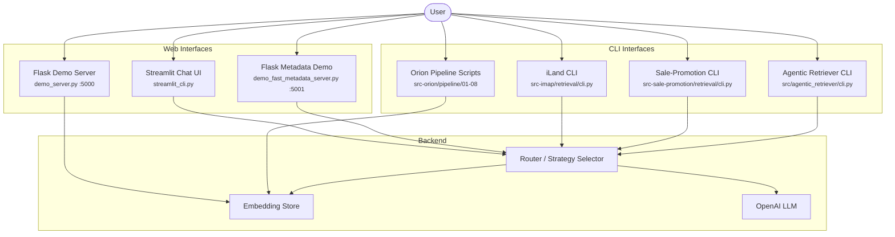
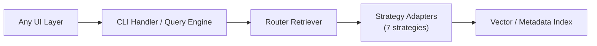

# Frontend & User Interfaces

> Architecture documentation for all user-facing entry points in the RAG pipeline project.

---

## 1. Architecture Overview

The project uses **Python-only frontends** -- no JavaScript frameworks, no bundlers, no Node.js tooling. All user interfaces are built with:

| Layer | Technology | Purpose |
|-------|-----------|---------|
| Web chat UI | **Streamlit** | Interactive WhatsApp-style chat for retrieval |
| Web demos | **Flask** + embedded HTML | Lightweight demo servers with inline templates |
| Terminal CLI | **argparse** + **colorama** | Primary operator interface for all pipelines |

This keeps the dependency footprint small and ensures every interface can be launched with a single `python` or `streamlit` command.

---

## 2. User Entry Points



---

## 3. Component Inventory

### 3.1 Streamlit Chat UI

**File:** `src-imap/retrieval/streamlit_cli.py`

The only Streamlit application in the project. Provides a WhatsApp-style chat interface for the iLand land deed retrieval system.

**Launch command:**
```bash
streamlit run src-imap/retrieval/streamlit_cli.py
```

**Key design decisions:**

- **Session state management** -- Uses `st.session_state` to persist chat history, CLI instance, initialization status, and typing indicator across Streamlit reruns.
- **WhatsApp-style CSS** -- Injected via `st.markdown(WHATSAPP_CSS, unsafe_allow_html=True)` with custom CSS classes for user messages (green bubbles, right-aligned) and assistant messages (white bubbles, left-aligned).
- **Initialization flow** -- On first load, creates an `iLandRetrievalCLI` instance, loads the latest embeddings, and creates the LLM router. Progress shown with `st.spinner`.
- **Chat input** -- Uses `st.chat_input()` for the message box. On submit, appends user message to session state, sets `is_typing=True`, and triggers `st.rerun()` to render the message before executing the query.
- **Sidebar controls** -- Settings panel with `top_k` slider, "Show technical details" toggle, chat export (JSON download), and clear-chat button with confirmation checkbox.

**Session state keys:**

| Key | Type | Purpose |
|-----|------|---------|
| `cli` | `iLandRetrievalCLI` | Backend retrieval handler |
| `messages` | `list[dict]` | Chat history with role, content, time, results |
| `initialized` | `bool` | Whether embeddings and router are loaded |
| `is_typing` | `bool` | Controls typing indicator rendering |

**CSS class structure:**

```
.stApp            -- background color (#e5ddd5, WhatsApp beige)
.user-message     -- green bubble, right-aligned, 70% max-width
.assistant-message -- white bubble, left-aligned, 70% max-width
.message-time     -- small gray timestamp text
.search-result    -- gray background with green left border
.header           -- dark green banner (#075e54)
```

### 3.2 Flask Demo Servers

Two Flask servers provide lightweight web demos with embedded HTML templates (no external template files).

#### 3.2.1 RAG Demo Server

**File:** `src-imap/demo_server.py`
**Port:** 5000

A full-page demo with query input, example queries, and embedding statistics. Uses `render_template_string()` with a single inline HTML template containing embedded CSS and JavaScript.

**Routes:**

| Route | Method | Purpose |
|-------|--------|---------|
| `/` | GET | Main demo page with query form and stats |
| `/query` | POST | JSON API -- accepts `{query: "..."}`, returns `{success, response}` |
| `/stats` | GET | JSON endpoint for embedding and batch statistics |
| `/health` | GET | Health check -- reports RAG system initialization status |

**Template pattern:** The HTML template uses Jinja2 syntax (`{{ stats.total_count }}`) for server-rendered statistics, plus vanilla JavaScript `fetch()` for AJAX query submission.

#### 3.2.2 Fast Metadata Filtering Demo

**File:** `src-imap/demo_fast_metadata_server.py`
**Port:** 5001

Demonstrates the fast metadata filtering system with form-based filter inputs (province, district, deed type, minimum area). Includes a test mode with sample Thai land deed nodes when real data is unavailable.

**Routes:**

| Route | Method | Purpose |
|-------|--------|---------|
| `/` | GET | Demo page with metadata filter form |
| `/test_filter` | POST | JSON API -- accepts `{query, filters}`, returns results with timing |
| `/stats` | GET | Fast indexing statistics |

**Common Flask patterns across both servers:**
- Global variables for initialized index/retriever state
- `initialize_*()` function called in `main()` before `app.run()`
- `render_template_string()` with inline HTML (no templates directory)
- JSON API endpoints for frontend-to-backend communication
- Error handling returns `jsonify({"error": str(e)})` or `jsonify({"success": False, ...})`

### 3.3 CLI Interfaces

All CLIs use `argparse.ArgumentParser` and follow a consistent pattern: parse arguments, initialize system, dispatch to the requested mode.

#### 3.3.1 iLand Retrieval CLI

**Files:**
- `src-imap/retrieval/cli.py` -- Entry point and argument parsing
- `src-imap/retrieval/cli_handlers.py` -- `iLandRetrievalCLI` class
- `src-imap/retrieval/cli_operations.py` -- Query execution logic
- `src-imap/retrieval/cli_utils.py` -- Colorama helpers and import setup

**Launch commands:**
```bash
# Interactive mode
python -m src_iLand.retrieval.cli --load-embeddings latest --interactive

# Single query
python -m src_iLand.retrieval.cli --load-embeddings latest --query "query text"

# Test multiple queries
python -m src_iLand.retrieval.cli --load-embeddings latest --test-queries "q1" "q2"

# Batch summary
python -m src_iLand.retrieval.cli --batch-summary
```

**Key arguments:**

| Flag | Purpose |
|------|---------|
| `--load-embeddings {all,latest}` | Load embeddings before query |
| `--strategy-selector {llm,heuristic,round_robin}` | Strategy selection method |
| `--query` | Single query execution |
| `--interactive` | REPL mode with `/` commands |
| `--test-queries` | Multi-query testing |
| `--enable-cache` | Enable query result caching |
| `--enable-parallel` | Enable parallel strategy execution |

**Interactive mode commands:**
The interactive REPL uses a colored prompt (`iLand> `) and supports slash commands:

```
/quit              Exit interactive mode
/help              Show available commands
/summary           Show batch summary
/strategies <q>    Test query with all strategies
/parallel <q>      Test parallel strategy execution
/response <q>      Get detailed RAG response
/cache-stats       Show cache statistics
/clear-cache       Clear all caches
```

**Colorama integration:** The CLI uses `colorama` (with `autoreset=True`) for cross-platform terminal colors. Helper functions in `cli_utils.py`:
- `print_colored_header(text)` -- Cyan header with dashes
- `print_success(text)` -- Green with checkmark
- `print_error(text)` -- Red with cross mark
- `print_warning(text)` -- Yellow with warning sign

#### 3.3.2 Sale-Promotion CLI

**File:** `src-sale-promotion/retrieval/cli.py`

The most feature-complete CLI, with a `SalesPromotionCLI` class that encapsulates system initialization, query processing, and output formatting.

**Launch commands:**
```bash
# Interactive mode
python -m src_sale_promotion.retrieval.cli --interactive

# Single query
python -m src_sale_promotion.retrieval.cli --query "query text"

# Run automated tests
python -m src_sale_promotion.retrieval.cli --run-tests

# Verbose with strategy override
python -m src_sale_promotion.retrieval.cli -q "query" -v -s metadata
```

**Key arguments:**

| Flag | Purpose |
|------|---------|
| `-i, --interactive` | REPL mode |
| `-q, --query` | Single query |
| `-t, --run-tests` | Automated test suite |
| `-v, --verbose` | Detailed performance metrics |
| `-d, --debug` | Debug information with node details |
| `-k, --top-k` | Number of results (default: 5) |
| `-s, --strategy` | Force specific strategy (vector, metadata, hybrid, etc.) |
| `--no-stream` | Disable response streaming |
| `--embedding-path` | Override embedding directory |
| `--list-embeddings` | List available embedding directories |

**Distinguishing features:**
- **Cache warming** -- Pre-caches 14 common Thai/English queries on startup for faster responses.
- **Response streaming** -- Enabled by default; can be disabled with `--no-stream`.
- **Session summary** -- On exit, prints query count, session time, and cache hit rate.
- **Strategy override** -- `-s metadata` forces a specific retrieval strategy, bypassing the router.

#### 3.3.3 Agentic Retriever CLI

**Files:**
- `src/agentic_retriever/cli.py` -- Entry point, persistent cache system, query logic
- `src/agentic_retriever/__main__.py` -- Module entry point

**Launch commands:**
```bash
python -m src.agentic_retriever -q "What are the main topics?"
python -m src.agentic_retriever --cache-status
python -m src.agentic_retriever --clear-cache
```

**Key arguments:**

| Flag | Purpose |
|------|---------|
| `-q, --query` | Query to process |
| `--top_k` | Number of results (default: 5) |
| `--verbose` | Verbose output with performance breakdown |
| `--performance` | Detailed performance stage timing |
| `--cache-status` | Show persistent cache status |
| `--clear-cache` | Clear all caches |
| `--force-refresh` | Rebuild all caches |

**Distinguishing features:**
- **Persistent file-based cache** -- Caches embeddings (2h TTL), adapters (2h), and router (1h) to `.cache/` directory as pickle files with timestamp validation.
- **Cold/warm start detection** -- Reports whether the query used a cached router (<100ms) or required a cold start.
- **Performance stage tracking** -- Breaks down timing into model setup, router initialization, query engine creation, and query execution.
- **PRD-formatted output** -- Prints results as `index = X | strategy = Y | latency = Z ms`.

#### 3.3.4 Orion Pipeline Scripts

**Directory:** `src-orion/pipeline/`

Eight numbered scripts (`01` through `08`) each with their own `argparse` parser. These are not interactive CLIs but rather pipeline stage scripts.

**Pattern:** Each script follows:
```python
def parse_args() -> argparse.Namespace:
    parser = argparse.ArgumentParser(description=__doc__)
    # stage-specific arguments
    return parser.parse_args()

def main():
    args = parse_args()
    # execute pipeline stage
```

These scripts are typically run sequentially and accept `--input-dir`, `--output-dir`, and stage-specific flags.

---

## 4. Design Patterns Summary

### 4.1 No JavaScript Frameworks

All frontend interactivity is handled by:
- **Streamlit** for stateful chat UIs (session state, widgets, reruns)
- **Inline vanilla JS** in Flask templates for AJAX form submission
- **Terminal REPL loops** for interactive CLIs

This eliminates the need for npm, webpack, React, or any JS build toolchain.

### 4.2 Shared Backend Access Pattern

All frontends share the same access pattern to the retrieval backend:



- **Streamlit** wraps `iLandRetrievalCLI` and calls `cli.query()`
- **Flask servers** initialize a `query_engine` or `retriever_adapter` directly
- **CLIs** instantiate their respective handler class and dispatch to operations

### 4.3 CLI Argument Conventions

All CLIs follow consistent conventions:

| Convention | Example |
|-----------|---------|
| Short flags for common options | `-q`, `-v`, `-k`, `-s` |
| `--interactive` / `-i` for REPL mode | All retrieval CLIs |
| `--verbose` / `-v` for detailed output | All CLIs |
| `--query` / `-q` for single-shot mode | All retrieval CLIs |
| `RawDescriptionHelpFormatter` | Preserves example formatting in `--help` |
| Epilog with usage examples | Shows common invocations |

### 4.4 Initialization Sequence

Every interface follows the same startup sequence, regardless of frontend type:

1. **Load environment** -- `dotenv` reads `.env` for `OPENAI_API_KEY` and model config
2. **Load embeddings** -- From disk or cache (PKL/NPY files)
3. **Build indices** -- Vector store index, optional metadata index
4. **Create router** -- Strategy adapters + index classifier + strategy selector
5. **Accept queries** -- Via chat input, HTTP POST, or terminal prompt

---

## 5. File Reference

| File | Type | Description |
|------|------|-------------|
| `src-imap/retrieval/streamlit_cli.py` | Streamlit | WhatsApp-style chat UI for iLand |
| `src-imap/demo_server.py` | Flask | RAG demo with query form (port 5000) |
| `src-imap/demo_fast_metadata_server.py` | Flask | Metadata filtering demo (port 5001) |
| `src-imap/retrieval/cli.py` | CLI | iLand retrieval entry point |
| `src-imap/retrieval/cli_handlers.py` | CLI | iLand CLI class with interactive mode |
| `src-imap/retrieval/cli_operations.py` | CLI | Query execution and result formatting |
| `src-imap/retrieval/cli_utils.py` | CLI | Colorama helpers and import utilities |
| `src-sale-promotion/retrieval/cli.py` | CLI | Sale-promotion retrieval with streaming |
| `src/agentic_retriever/cli.py` | CLI | General-purpose agentic retriever |
| `src/agentic_retriever/__main__.py` | CLI | Module entry point |
| `src-orion/pipeline/01-08_*.py` | CLI | Orion pipeline stage scripts |
