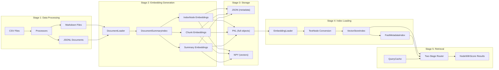
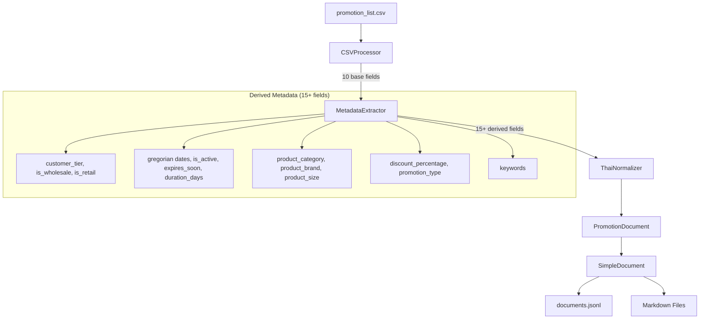
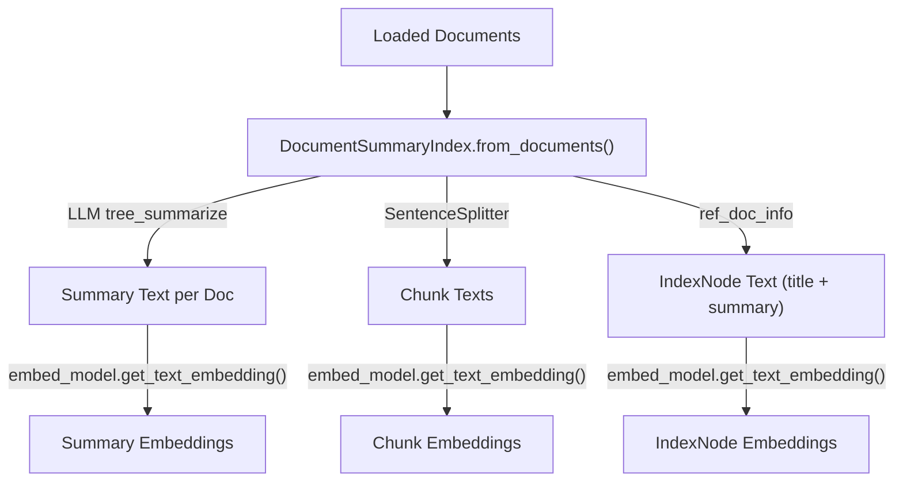
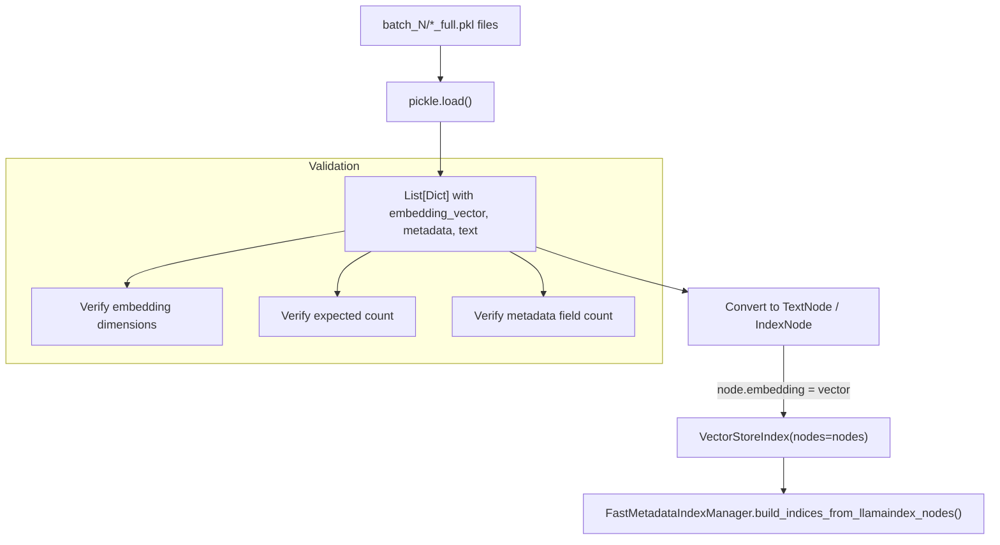
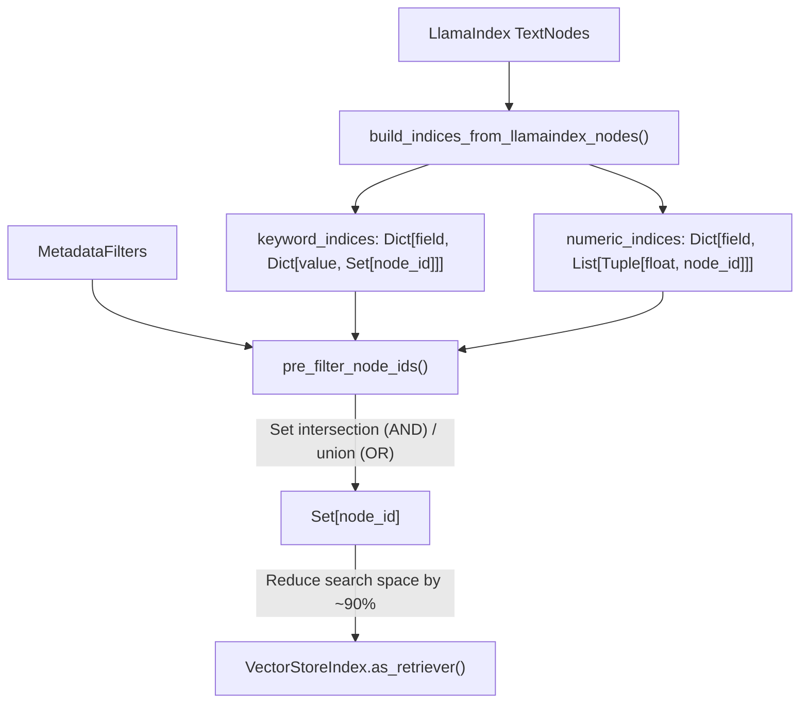
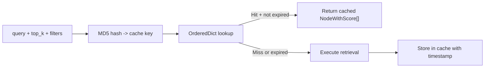

# Backend & Data Pipeline

This document describes the stage-by-stage data flow from raw CSV input through embedding generation, index loading, and retrieval. The project contains three pipeline implementations that share the same architectural pattern but differ in domain-specific processing.

---

## End-to-End Flow



---

## Stage 1: Data Processing

Transforms raw CSV data into structured documents with rich metadata. Each pipeline has domain-specific processors but follows the same pattern: **CSV -> extraction -> metadata derivation -> text generation -> dual output (JSONL + Markdown)**.

### Main Pipeline (`src/`)

| File | Class | Role |
|------|-------|------|
| `src/02_prep_doc_for_embedding.py` | `FlexibleCSVConverter` | General-purpose CSV-to-Document converter |
| `src/02_prep_doc_for_embedding.py` | `FieldMapping`, `DatasetConfig` | YAML-driven schema configuration |

The main pipeline auto-analyzes CSV structure, suggests field mappings by pattern-matching column names against known categories (identifier, demographic, education, career, compensation, assessment), and generates a YAML configuration. Each CSV row becomes a `SimpleDocument` with structured text sections and metadata.

**Output**: JSONL file + individual Markdown files in `data/output_docs/markdown_files/`.

### Sale-Promotion Pipeline (`src-sale-promotion/`)



| File | Class | Role |
|------|-------|------|
| `src-sale-promotion/data_processing/main.py` | `PromotionDataProcessor` | 7-step pipeline orchestrator |
| `src-sale-promotion/data_processing/processors/csv_processor.py` | `CSVProcessor` | UTF-8 CSV loading, field extraction with alias support |
| `src-sale-promotion/data_processing/processors/metadata_extractor.py` | `MetadataExtractor` | Derives 15+ fields from 10 base fields |
| `src-sale-promotion/data_processing/processors/thai_normalizer.py` | `ThaiNormalizer` | Thai text normalization, unit standardization |
| `src-sale-promotion/data_processing/processors/text_generator.py` | `TextGenerator` | Natural language promotion descriptions (50-200 tokens) |
| `src-sale-promotion/data_processing/models.py` | `PromotionDocument`, `SimpleDocument` | Domain data models with 25+ metadata fields |

**Thai support**: Buddhist-to-Gregorian date conversion (`date_utils`), Thai unit normalization (e.g., `'แพค' -> 'แพ็ค'`), product keyword extraction from Thai product names.

### iMap Pipeline (`src-imap/`)

| File | Class | Role |
|------|-------|------|
| `src-imap/data_processing/main.py` | Main orchestrator | iLand dataset processing |
| `src-imap/data_processing/iland_converter.py` | `iLandCSVConverter` | Thai land deed CSV conversion with province support |
| `src-imap/data_processing/document_processor.py` | `DocumentProcessor` | Row-to-document conversion with Thai metadata |
| `src-imap/data_processing/csv_analyzer.py` | `CSVAnalyzer` | CSV structure analysis with encoding detection |

**Thai support**: Unicode range `\u0e00-\u0e7f`, built-in Thai province list (`common/thai_provinces.py`), land deed types (chanote, nor sor 3/4), geographic metadata (province/district/sub-district).

---

## Stage 2: Embedding Generation

All pipelines use `DocumentSummaryIndex` from LlamaIndex as the core engine for generating LLM summaries and chunked embeddings. Files are processed in configurable batches with API rate-limiting delays between batches.

### Three Embedding Types



| Type | Purpose | Content | Typical Use |
|------|---------|---------|-------------|
| **IndexNode** | Document-level pointers for recursive retrieval | `"Document: {title}\n\nSummary: {summary}"` | Top-level routing, recursive retrieval |
| **Chunk** | Granular content segments | Sentence-split text (1024 tokens default) | Vector search, hybrid search |
| **Summary** | LLM-generated document summaries | `tree_summarize` output | Summary-first retrieval |

### Pipeline-Specific Differences

| Aspect | Main (`src/`) | Sale-Promotion (`src-sale-promotion/`) | iMap (`src-imap/`) |
|--------|---------------|----------------------------------------|---------------------|
| Embedding model | `text-embedding-3-small` (1536 dim) | `text-embedding-3-large` (3072 dim) | `text-embedding-3-small` (1536 dim) |
| LLM model | `gpt-4o-mini` | `gpt-5` | `gpt-4o-mini` |
| Chunk size | 1024 | 2048 (no chunking -- docs are atomic) | 1024 |
| Chunk overlap | 50 | 0 | 200 |
| Batch size | 20 files | 20 promotions | 20 files |
| Extra features | -- | No chunk embeddings (atomic docs) | Section-based chunking, sentence window embeddings |

### Key Classes

| File | Class | Role |
|------|-------|------|
| `src/09_enhanced_batch_embeddings.py` | `StructuredMarkdownLoader` | Loads markdown with regex-based metadata extraction |
| `src-sale-promotion/docs_embedding/batch_embedding.py` | `SalesPromotionBatchEmbeddingPipeline` | Orchestrates load -> embed -> save for promotions |
| `src-sale-promotion/docs_embedding/embedding_processor.py` | `EmbeddingProcessor` | Builds `DocumentSummaryIndex`, extracts indexnode/summary embeddings |
| `src-sale-promotion/docs_embedding/document_loader.py` | `PromotionDocumentLoader` | Loads JSONL, validates 25+ metadata fields, converts to LlamaIndex `Document` |
| `src-imap/docs_embedding/batch_embedding.py` | `iLandBatchEmbeddingPipeline` | Production pipeline with sentence windows, hierarchical retrieval, query routing |

### Batch Processing Flow

```
for each batch of files:
    1. Load documents (markdown or JSONL)
    2. Build DocumentSummaryIndex (LLM generates summaries)
    3. Create IndexNodes (title + truncated summary)
    4. Extract embeddings manually via embed_model.get_text_embedding()
    5. Save to batch_N/ directory in 3 formats
    6. Sleep(delay_between_batches) for API rate limiting
```

---

## Stage 3: Embedding Storage

Every batch produces a directory with this structure:

```
embeddings_{pipeline}_{timestamp}/
├── batch_1/
│   ├── indexnodes/
│   │   ├── batch_1_indexnodes_metadata.json    # Metadata + embedding preview (first 5 dims)
│   │   ├── batch_1_indexnodes_full.pkl         # Complete Python objects with vectors
│   │   └── batch_1_indexnodes_vectors.npy      # Raw numpy arrays
│   ├── chunks/           # (same 3 formats)
│   ├── summaries/        # (same 3 formats)
│   ├── combined/         # All types merged
│   └── batch_1_statistics.json
├── batch_2/
│   └── ...
└── combined_statistics.json
```

### Three Storage Formats

| Format | File | Purpose | Size | Load Speed |
|--------|------|---------|------|------------|
| **JSON** | `*_metadata.json` | Human-readable metadata with embedding preview (first 5 dims) | Small | Fast |
| **PKL** | `*_full.pkl` | Complete Python dicts including full embedding vectors | Large | Medium |
| **NPY** | `*_vectors.npy` | Raw numpy arrays for numerical operations | Medium | Fastest |

The JSON files contain all metadata fields and text but replace the full embedding vector with a 5-element preview array. The PKL files are the primary format used for index reconstruction. The NPY files enable direct numerical operations (cosine similarity, clustering) without deserializing Python objects.

Key implementation: `src-sale-promotion/docs_embedding/file_storage.py` (`EmbeddingStorage._save_embedding_collection`).

---

## Stage 4: Index Loading

Loads persisted embeddings from PKL files and reconstructs LlamaIndex `VectorStoreIndex` objects for retrieval.



### Key Classes

| File | Class | Role |
|------|-------|------|
| `src-sale-promotion/retrieval/loader.py` | `EmbeddingLoader` | Loads PKL files from all batches, validates dims (3072), builds `VectorStoreIndex` |
| `src-imap/load_embedding/embedding_loader.py` | `iLandEmbeddingLoader` | Loads from timestamped batch directories, supports filtering by province/deed_type/area |
| `src-imap/load_embedding/index_reconstructor.py` | `iLandIndexReconstructor` | Creates `VectorStoreIndex` with `SimpleVectorStore` + `StorageContext` |
| `src-imap/load_embedding/models.py` | `EmbeddingConfig`, `FilterConfig`, `LoadingResult` | Configuration and result types |

### VectorStoreIndex Reconstruction

The reconstruction process converts embedding dicts back into LlamaIndex nodes with pre-computed embeddings:

```python
# From src-sale-promotion/retrieval/loader.py
for emb in indexnode_embeddings:
    node = TextNode(
        text=emb['text'],
        metadata=emb['metadata'],
        id_=emb['node_id'],
        embedding=emb['embedding_vector']  # Pre-computed, no API call needed
    )
    nodes.append(node)

vector_index = VectorStoreIndex(nodes=nodes, embed_model=embed_model)
```

The embedding model must match the one used during generation (e.g., `text-embedding-3-large` for sale-promotion, `text-embedding-3-small` for imap). Mismatched dimensions will cause runtime errors.

### Embedding Path Resolution

The sale-promotion pipeline (`src-sale-promotion/retrieval/config.py`) resolves embedding paths with this priority:

1. Explicit CLI argument
2. `EMBEDDING_DIR` environment variable
3. Latest timestamped directory under known root candidates

The imap pipeline scans for directories matching `embeddings_iland_*` and sorts by timestamp.

---

## Stage 5: FastMetadataIndex

A pre-filtering layer that runs **on top of** LlamaIndex's vector search. Builds in-memory indices for sub-50ms metadata filtering before the more expensive vector similarity computation.

### Two Implementations

| File | Class | Index Types | Target |
|------|-------|-------------|--------|
| `src-imap/retrieval/fast_metadata_index.py` | `FastMetadataIndexManager` | Inverted (categorical) + B-tree (numeric) | 50k+ Thai land deed documents |
| `src-sale-promotion/retrieval/fast_metadata_index.py` | `FastMetadataIndex` | Inverted (categorical) + Range (numeric) + Boolean | 71 promotion documents |

### FastMetadataIndexManager (iMap) -- Architecture



**Inverted indices** (categorical): `field -> value -> {doc_ids}`. O(1) lookup.

**B-tree indices** (numeric): Sorted `List[Tuple[float, doc_id]]` with `bisect` for binary search. Supports `$gt`, `$gte`, `$lt`, `$lte`, `$eq`, `$ne` operators.

**Indexed fields** (sale-promotion): `customer_type`, `customer_tier`, `product_category`, `product_brand`, `product_size`, `promotion_type`, `buy_unit`, `free_unit`, `discount_percentage`, `buy_quantity`, `free_quantity`, `duration_days`, `is_active`, `is_wholesale`, `is_retail`, `expires_soon`.

**Performance target**: <50ms filter time, <10% memory overhead vs vector store alone.

---

## Caching Architecture

### QueryCache / TTLCache

Two caching implementations provide LRU eviction with TTL expiration for query results:



| File | Class | Max Size | TTL | Key Components |
|------|-------|----------|-----|----------------|
| `src-imap/retrieval/cache.py` | `TTLCache` | 1000 | 3600s (1h) | Base cache with LRU + TTL |
| `src-imap/retrieval/cache.py` | `QueryCache` | 500 | 1800s (30m) | Wraps TTLCache, adds query key hashing |
| `src-imap/retrieval/cache.py` | `iLandCacheManager` | configurable | configurable | Centralized manager with env-based config |
| `src-sale-promotion/retrieval/cache.py` | `QueryCache` | 100 | 3600s (1h) | Standalone LRU cache with hit/miss stats |

**Cache key generation**: Deterministic hash of `query + top_k + strategy + index` (imap) or `query + top_k + filters` (sale-promotion).

**Configuration** (`src-sale-promotion/retrieval/config.py`):
```python
CACHE_CONFIG = {
    "enable_caching": True,    # ENABLE_CACHING env var
    "cache_max_size": 100,     # CACHE_MAX_SIZE env var
    "cache_ttl": 3600,         # CACHE_TTL env var (seconds)
}
```

**Performance target**: >30% cache hit rate, 50% latency reduction for cached queries.

### Cache Integration in Router

Both routers check the cache before executing retrieval:

```python
# From src-sale-promotion/retrieval/router.py (PromotionRouter.route)
if self.enable_caching:
    cached_results = self.cache.get(query, top_k, filters)
    if cached_results:
        return cached_results  # Skip Stage 1 + Stage 2 entirely

# ... execute two-stage routing ...

if self.enable_caching:
    self.cache.set(query, nodes, top_k, filters)
```

---

## Pipeline Comparison

| Dimension | Main (`src/`) | Sale-Promotion (`src-sale-promotion/`) | iMap (`src-imap/`) |
|-----------|---------------|----------------------------------------|---------------------|
| **Domain** | General-purpose (candidate profiles) | Thai sales promotions (buy-X-get-Y) | Thai land deed documents |
| **Data processing** | `FlexibleCSVConverter` (auto-schema) | `PromotionDataProcessor` (7-step pipeline) | `iLandCSVConverter` (province-aware) |
| **Thai support** | Basic (province detection) | Unit normalization, Buddhist dates | Full (provinces, deed types, land areas) |
| **Embedding types** | IndexNodes + Chunks + Summaries | IndexNodes + Summaries (no chunks) | IndexNodes + Chunks + Summaries + Sentence Windows |
| **Embedding dims** | 1536 | 3072 | 1536 |
| **Index loading** | Direct script usage | `EmbeddingLoader` with validation | `iLandEmbeddingLoader` + `iLandIndexReconstructor` |
| **Fast metadata** | None | `FastMetadataIndex` (categorical + numeric + boolean) | `FastMetadataIndexManager` (inverted + B-tree, LlamaIndex-native filters) |
| **Caching** | None | `QueryCache` (LRU + TTL) | `iLandCacheManager` (TTLCache + QueryCache) |
| **Router** | `src/agentic_retriever/` | `PromotionRouter` (two-stage) | `iLandRouterRetriever` (two-stage, LLM strategy selection) |
| **Retrieval strategies** | 7 (scripts `10-17`) | 7 (vector, summary, recursive, metadata, hybrid, chunk_decoupling, planner) | 7+ (same set + section retriever) |
| **Architecture** | Numbered scripts | Modular packages | Modular packages (most advanced) |
| **Chunking** | SentenceSplitter (1024/50) | Disabled (atomic docs) | Section-based + sentence windows |

### Shared Patterns

All three pipelines share these architectural patterns:

1. **DocumentSummaryIndex** as the core embedding engine (LLM-generated summaries via `tree_summarize`)
2. **Three storage formats** (JSON, PKL, NPY) for every embedding type
3. **Batch processing** with configurable batch size and API rate-limiting delays
4. **Metadata preservation** -- original document metadata flows through to embeddings and into retrieval nodes
5. **VectorStoreIndex reconstruction** from pre-computed embeddings (no re-embedding at query time)
6. **Two-stage routing** for query classification and strategy selection

---

## Key File Reference

### Data Processing
- `src/02_prep_doc_for_embedding.py` -- Main pipeline CSV converter
- `src-sale-promotion/data_processing/main.py` -- Sale-promotion orchestrator
- `src-sale-promotion/data_processing/processors/csv_processor.py` -- CSV field extraction
- `src-sale-promotion/data_processing/processors/metadata_extractor.py` -- 15+ derived metadata fields
- `src-sale-promotion/data_processing/processors/thai_normalizer.py` -- Thai text/unit normalization
- `src-sale-promotion/data_processing/models.py` -- `PromotionDocument`, `SimpleDocument`
- `src-imap/data_processing/iland_converter.py` -- Thai land deed CSV conversion
- `src-imap/data_processing/main.py` -- iMap data processing entry point

### Embedding Generation
- `src/09_enhanced_batch_embeddings.py` -- Main pipeline batch embeddings
- `src-sale-promotion/docs_embedding/batch_embedding.py` -- Sale-promotion embedding pipeline
- `src-sale-promotion/docs_embedding/embedding_processor.py` -- `EmbeddingProcessor`
- `src-sale-promotion/docs_embedding/document_loader.py` -- JSONL loader with validation
- `src-sale-promotion/docs_embedding/file_storage.py` -- Multi-format storage (`EmbeddingStorage`)
- `src-imap/docs_embedding/batch_embedding.py` -- iMap production embedding pipeline

### Index Loading
- `src-sale-promotion/retrieval/loader.py` -- `EmbeddingLoader` (PKL loading, VectorStoreIndex)
- `src-sale-promotion/retrieval/config.py` -- Centralized config with embedding path resolution
- `src-imap/load_embedding/embedding_loader.py` -- `iLandEmbeddingLoader`
- `src-imap/load_embedding/index_reconstructor.py` -- `iLandIndexReconstructor`
- `src-imap/load_embedding/models.py` -- `EmbeddingConfig`, `FilterConfig`, `LoadingResult`

### Caching & Fast Metadata
- `src-sale-promotion/retrieval/cache.py` -- `QueryCache` (LRU + TTL)
- `src-imap/retrieval/cache.py` -- `TTLCache`, `QueryCache`, `iLandCacheManager`
- `src-sale-promotion/retrieval/fast_metadata_index.py` -- `FastMetadataIndex`
- `src-imap/retrieval/fast_metadata_index.py` -- `FastMetadataIndexManager` (B-tree + inverted indices)

### Routing
- `src-sale-promotion/retrieval/router.py` -- `PromotionRouter` (two-stage)
- `src-imap/retrieval/router.py` -- `iLandRouterRetriever` (two-stage, LLM strategy)
