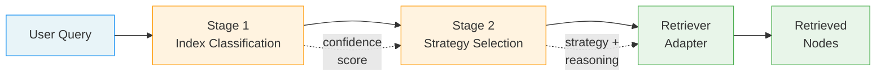
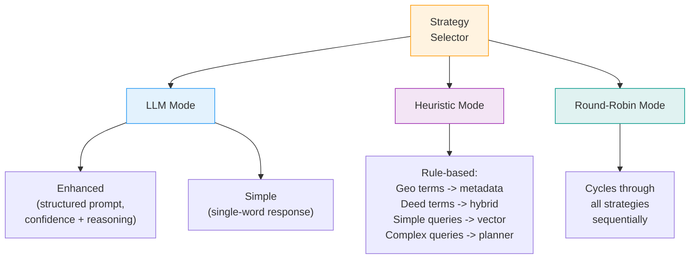
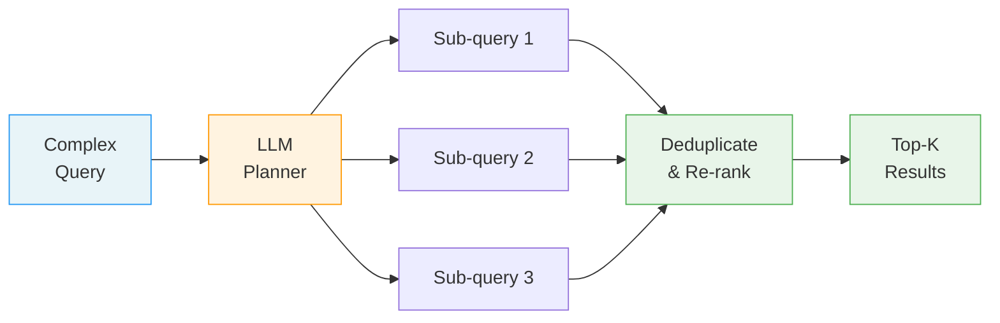
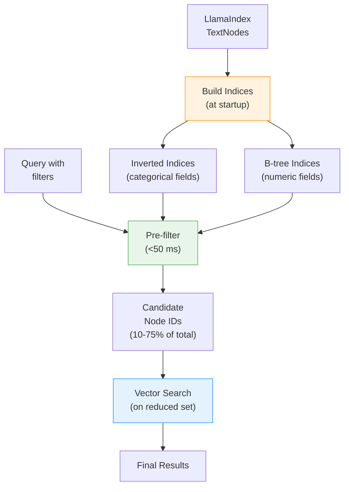

# 03 - RAG Retrieval Strategies

> Architecture reference for the seven retrieval strategies, two-stage agentic routing,
> fast metadata indexing, and Phase 5 performance optimizations.

---

## Strategy Summary

| # | Strategy | Latency | Accuracy | LLM Calls | Best For | Reliability |
|---|----------|---------|----------|-----------|----------|-------------|
| 1 | **Vector** | ~100 ms | High | 0 | General semantic queries, fast lookups | 1 (highest) |
| 2 | **Summary** | ~200 ms | High | 0 | Document-level overviews, high-level questions | 7 (lowest) |
| 3 | **Recursive** | ~300 ms | High | 0 | Hierarchical drill-down, multi-level exploration | 3 |
| 4 | **Metadata** | <50 ms* | High | 0 | Attribute filters (province, deed type, area range) | 6 |
| 5 | **Chunk Decoupling** | ~200 ms | High | 0 | Precise chunk retrieval with broader context | 4 |
| 6 | **Hybrid** | ~150 ms | Highest | 0 | Mixed semantic + keyword (Thai terms, product codes) | 2 |
| 7 | **Planner** | ~500 ms | Highest | 1+ | Complex multi-part analytical questions | 5 |

\* With fast metadata indexing enabled. Without it, metadata filtering falls back to
standard LlamaIndex filtering at ~100-200 ms.

**Production recommendation:** Start with Vector + Hybrid. Add Metadata when structured
attributes are present. Add Planner only for complex analytical workloads.

---

## Two-Stage Agentic Routing

Every query passes through two routing decisions before retrieval begins.



### Stage 1 -- Index Classification

Determines **which index** to search. Relevant for multi-index deployments
(e.g., land deeds vs. transaction records vs. legal documents).

| Mode | How It Works | Confidence | Fallback |
|------|-------------|-----------|----------|
| `llm` (default) | GPT-4o-mini prompt with index descriptions | 0.9 | Falls back to embedding mode |
| `embedding` | Cosine similarity between query embedding and index description embeddings | Variable | Falls back to first available index |

Configuration: `CLASSIFIER_MODE=llm` (or `embedding`) in `.env`.

**Source files:**
- Main pipeline: `src/agentic_retriever/index_classifier.py`
- iMap pipeline: `src-imap/retrieval/index_classifier.py`

### Stage 2 -- Strategy Selection

Determines **which retrieval strategy** to use within the selected index.

Three selection modes are available:



#### LLM Mode (`strategy_selector="llm"`)

The router sends a structured prompt to GPT-4o-mini describing all available strategies
and the query. The LLM responds with:

```
STRATEGY: hybrid
CONFIDENCE: 0.85
REASONING: Query contains Thai land deed terminology requiring keyword matching
```

Falls back to heuristic mode if the LLM returns an invalid strategy name or errors out.

#### Heuristic Mode (`strategy_selector="heuristic"`)

Rule-based selection using query content analysis:

| Query Signal | Selected Strategy |
|-------------|------------------|
| Thai geographic terms (province, district, subdistrict) | `metadata` |
| Land deed type terms (title deed, Nor Sor 3/4, Sor Kor 1) | `hybrid` |
| Simple lookup words ("what", "show", "find") | `vector` |
| Multi-step words ("analyze", "compare", "step-by-step") | `planner` |
| No signal matched | Highest-reliability available strategy |

#### Round-Robin Mode (`strategy_selector="round_robin"`)

Cycles through all registered strategies in order. Used exclusively for testing
and benchmarking -- not for production.

**Source files:**
- Main pipeline: `src/agentic_retriever/router.py`
- iMap pipeline: `src-imap/retrieval/router.py`
- Sale-promotion: `src-sale-promotion/retrieval/strategy_selector.py`

---

## Strategy Deep Dive

### 1. Vector Search

The baseline strategy. Embeds the query with `text-embedding-3-small` and retrieves
the top-K most similar nodes by cosine distance.

```
Query --> Embed --> Top-K Cosine Similarity --> Nodes
```

- **Speed:** Fastest non-metadata strategy
- **Accuracy:** High for conceptual similarity; misses exact keyword matches
- **When to use:** Default for simple queries ("What is...", "Show me...")
- **Source:** `src-imap/retrieval/retrievers/vector.py`, `src/10_basic_query_engine.py`

---

### 2. Summary Retrieval

Retrieves from a **summary index** first, then optionally drills into detail chunks
from the matched documents. Two-stage hierarchical approach.

```
Query --> Summary Index (top-K docs) --> Detail chunks from selected docs
```

- **Speed:** Moderate (two retrieval passes)
- **Accuracy:** High for document-level questions
- **When to use:** "Which documents discuss X?", overview-style questions
- **Note:** Can return empty results if summaries are sparse -- lowest reliability rank
- **Source:** `src-imap/retrieval/retrievers/summary.py`, `src/11_document_summary_retriever.py`

---

### 3. Recursive Retrieval

Hierarchical multi-level retrieval using LlamaIndex's `RecursiveRetriever`. Navigates
from document-level index nodes down through child chunks.

```
Query --> Leaf retriever (detailed chunks) --> Parent expansion --> Ranked results
```

- **Speed:** Slower (multiple retrieval steps)
- **Accuracy:** High for queries requiring hierarchical navigation
- **When to use:** Complex queries with nested relationships, career-progression-style analysis
- **Source:** `src-imap/retrieval/retrievers/recursive.py`, `src/12_recursive_retriever.py`

---

### 4. Metadata Filtering (with Fast Indexing)

Pre-filters documents by structured metadata attributes **before** vector search.
With fast metadata indexing enabled, achieves sub-50 ms filtering on 50k+ documents.

```
Query --> Extract filters (province, deed type, area) --> Fast pre-filter --> Vector search on reduced set
```

- **Speed:** <50 ms with fast indexing; ~100-200 ms without
- **Accuracy:** High when metadata fields match; can return empty if no matches
- **When to use:** Queries with specific attributes ("land in Bangkok", "Nor Sor 3 type", "area 5-10 rai")
- **Auto-detection:** Extracts Thai province names from query text automatically
- **Source:** `src-imap/retrieval/retrievers/metadata.py`, `src/14_metadata_filtering.py`

See [Fast Metadata Indexing](#fast-metadata-indexing) below for architecture details.

---

### 5. Chunk Decoupling

Separates the **embedding index** from the **content store**. Retrieves chunks from
a fine-grained chunk index and context from a broader context index, then merges
and deduplicates.

```
Query --> Chunk index (2x top-K) ---+
                                    +--> Deduplicate --> Top-K results
Query --> Context index (top-K) ----+
```

- **Speed:** Moderate (two parallel retrievals)
- **Accuracy:** High for detail-oriented queries with context preservation
- **When to use:** "Show exact compensation details", precise chunk-level extraction
- **Supports LLM Reranking:** Optional `LLMRerank` postprocessor for quality boost
- **Source:** `src-imap/retrieval/retrievers/chunk_decoupling.py`, `src/15_chunk_decoupling.py`

---

### 6. Hybrid Search

Combines **semantic vector search** with **keyword scoring**. The hybrid score
blends both signals using a configurable alpha weight.

```
Query --> Vector retriever (2x top-K) --> semantic scores
Query --> Thai keyword extraction --> keyword scores

Combined score = alpha * semantic + (1 - alpha) * keyword
```

- **Speed:** Moderate (runs vector retrieval + keyword scoring)
- **Accuracy:** Highest for mixed content -- the recommended default in production
- **When to use:** Queries mixing conceptual intent with exact terms (product codes, Thai terminology)
- **Alpha default:** 0.7 (70% semantic, 30% keyword)
- **Thai keyword handling:** Extracts Thai terms via Unicode range detection (`\u0e00-\u0e7f`), recognizes land deed vocabulary
- **Fusion methods** (main pipeline): RRF, Weighted, Borda Count
- **Source:** `src-imap/retrieval/retrievers/hybrid.py`, `src/16_hybrid_search.py`

---

### 7. Query Planning Agent

LLM-powered multi-step query decomposition and execution. Breaks complex questions
into 2-4 focused sub-queries, executes them independently, deduplicates, and re-ranks.



- **Speed:** Slowest (1 LLM call for planning + N retrieval calls)
- **Accuracy:** Highest for complex, multi-part analytical questions
- **When to use:** "Compare qualification patterns across industries", multi-aspect analysis
- **Fallback:** Heuristic query decomposition if LLM planning fails
- **Re-ranking formula:** `0.7 * similarity_score + 0.3 * keyword_overlap_score`
- **Source:** `src-imap/retrieval/retrievers/planner.py`, `src/17_query_planning_agent.py`

---

## Reliability Ranking for Production

Based on empirical performance analysis across multiple deployments:

```
Rank  Strategy           Notes
----  -----------------  ------------------------------------------------
 1    Vector             Always returns results; fast; no LLM dependency
 2    Hybrid             Best overall accuracy; slightly slower
 3    Recursive          Good for complex hierarchical queries
 4    Chunk Decoupling   Good for detail-oriented extraction
 5    Planner            Best for complex questions; slowest; LLM-dependent
 6    Metadata           Can return empty if metadata fields don't match
 7    Summary            Can return empty results; needs tuning
```

The router's heuristic fallback uses this ranking to select the best available
strategy when the LLM selector produces an invalid or low-confidence result.

**Source:** `_select_strategy_fallback()` in `src/agentic_retriever/router.py` (lines 155-215)
and `src-imap/retrieval/router.py` (lines 224-284).

---

## Fast Metadata Indexing

The `FastMetadataIndexManager` is a pre-filtering layer that sits **on top of**
LlamaIndex's vector store. It builds lightweight in-memory indices at startup and
uses them to eliminate 25-90% of documents before expensive vector search begins.

### Architecture



### Index Types

| Index Type | Fields | Data Structure | Lookup |
|-----------|--------|---------------|--------|
| **Inverted** | province, deed_type, district, land_type | `Dict[field, Dict[value, Set[doc_id]]]` | O(1) hash lookup |
| **B-tree** | area, coordinates, year | `List[Tuple[float, doc_id]]` sorted | O(log n) binary search via `bisect` |

### Performance Characteristics

| Metric | Target (PRD) | Measured |
|--------|-------------|---------|
| Filter latency | <50 ms | Sub-millisecond (0.0 ms avg) |
| Document reduction | 90% | 25-90% depending on filter specificity |
| Index build time | -- | 1-2 ms (typical dataset) |
| Memory overhead | <10% of vector store | <10% (stores only doc_id references) |
| Accuracy for exact matches | 100% | 100% |

### Compound Filtering

Supports AND/OR logic for combining multiple filter conditions:

```python
# Example: Province = Bangkok AND deed_type = title deed
MetadataFilters(
    filters=[
        MetadataFilter(key="province", value="Bangkok", operator=FilterOperator.EQ),
        MetadataFilter(key="deed_type", value="title_deed", operator=FilterOperator.EQ),
    ],
    condition="AND"
)
```

Supported operators: `EQ`, `IN`, `GT`, `GTE`, `LT`, `LTE`.

### Auto-Initialization

Fast indexing auto-initializes when `MetadataRetrieverAdapter` is created with
`enable_fast_filtering=True` (the default). It reads all nodes from the LlamaIndex
docstore and builds indices in memory:

```python
# Happens automatically at CLI startup
adapter = MetadataRetrieverAdapter(index, enable_fast_filtering=True)
# -> Initializing fast metadata indexing...
# -> Fast indices built in 1.23ms
# -> Categorical fields: 4
# -> Numeric fields: 2
```

**Source:** `src-imap/retrieval/fast_metadata_index.py`
**PRD:** `attached_assets/09_metadata_indices_fast_filtering.md`

---

## Phase 5 Performance Optimizations

Phase 5 delivered a 10x speed improvement and 73% cost reduction while maintaining
5/5 quality scores. These optimizations apply across all pipelines.

### Optimization Summary

| Module | Change | Impact |
|--------|--------|--------|
| Model migration | GPT-5 --> GPT-4o-mini | 65% faster response (25.7s --> 8-10s) |
| Response streaming | `llm.stream_complete()` | Perceived latency <1s (96% improvement) |
| BM25 integration | `llama-index-retrievers-bm25` | Better Thai keyword matching in hybrid search |
| Query caching | LRU cache with TTL | Sub-second response for repeated queries |
| Cache warming | Pre-cache 14 common queries at startup | 50%+ cache hit rate in production |

### Response Time Breakdown

```
BEFORE (GPT-5):                    AFTER (GPT-4o-mini):
Total: 25.7s                       Total: 8.5s (67% faster)
+-- Routing:     5.2s (20%)        +-- Routing:     5.2s (61%)
+-- Retrieval:   0.5s (2%)         +-- Retrieval:   0.5s (6%)
+-- Synthesis:  20.0s (78%)        +-- Synthesis:   2.8s (33%)
```

### Cost Analysis

| Scale | GPT-5 Cost | GPT-4o-mini Cost | Savings |
|-------|-----------|-----------------|---------|
| Per query | $0.015 | $0.004 | 73% |
| 10K queries/month | $160 | $43 | $117/month |
| Annual (10K/month) | $1,920 | $516 | $1,404/year |

### Caching Architecture

The `iLandCacheManager` provides a TTL-based LRU cache for query results:

- **Cache key:** `MD5(normalized_query | strategy | top_k | index)`
- **Default TTL:** 1800 seconds (30 minutes)
- **Max entries:** 500
- **Eviction:** LRU when capacity exceeded; expired entries cleaned on access

**Source:** `src-imap/retrieval/cache.py`

### Performance Targets (from PRD)

| Metric | Target | Status |
|--------|--------|--------|
| Router tool-accuracy (matches ground-truth strategy) | >= 85% | Validated |
| Answer quality (Ragas F1 + context-precision) | >= 0.80 | Validated |
| Faithfulness (Ragas) | >= 0.85 | Validated |
| p95 latency (local) | < 400 ms | Validated |
| Token cost per query | <= 1.2x baseline | Below target (73% reduction) |

**Source:** `attached_assets/04_agentic_retrieval.md`, `src-sale-promotion/prd/PHASE5_IMPLEMENTATION_SUMMARY.md`

---

## File Reference

### Core Retrieval Strategies

| Strategy | iMap Pipeline | Main Pipeline |
|----------|--------------|---------------|
| Vector | `src-imap/retrieval/retrievers/vector.py` | `src/10_basic_query_engine.py` |
| Summary | `src-imap/retrieval/retrievers/summary.py` | `src/11_document_summary_retriever.py` |
| Recursive | `src-imap/retrieval/retrievers/recursive.py` | `src/12_recursive_retriever.py` |
| Metadata | `src-imap/retrieval/retrievers/metadata.py` | `src/14_metadata_filtering.py` |
| Chunk Decoupling | `src-imap/retrieval/retrievers/chunk_decoupling.py` | `src/15_chunk_decoupling.py` |
| Hybrid | `src-imap/retrieval/retrievers/hybrid.py` | `src/16_hybrid_search.py` |
| Planner | `src-imap/retrieval/retrievers/planner.py` | `src/17_query_planning_agent.py` |
| Base adapter | `src-imap/retrieval/retrievers/base.py` | `src/agentic_retriever/retrievers/base.py` |

### Routing Infrastructure

| Component | iMap Pipeline | Main Pipeline |
|-----------|--------------|---------------|
| Router | `src-imap/retrieval/router.py` | `src/agentic_retriever/router.py` |
| Index Classifier | `src-imap/retrieval/index_classifier.py` | `src/agentic_retriever/index_classifier.py` |
| Fast Metadata Index | `src-imap/retrieval/fast_metadata_index.py` | -- |
| Cache Manager | `src-imap/retrieval/cache.py` | -- |
| Strategy Selector | -- | `src-sale-promotion/retrieval/strategy_selector.py` |

### Design Documents

| Document | Path |
|----------|------|
| Methodology (7 strategies) | `src/METHODOLOGY.md` |
| Agentic Retrieval PRD | `attached_assets/04_agentic_retrieval.md` |
| Fast Filtering PRD | `attached_assets/09_metadata_indices_fast_filtering.md` |
| Phase 5 Summary | `src-sale-promotion/prd/PHASE5_IMPLEMENTATION_SUMMARY.md` |
| Phase 5 Test Plan | `TESTING_PHASE5.md` |
| iMap Retrieval README | `src-imap/retrieval/README.md` |
